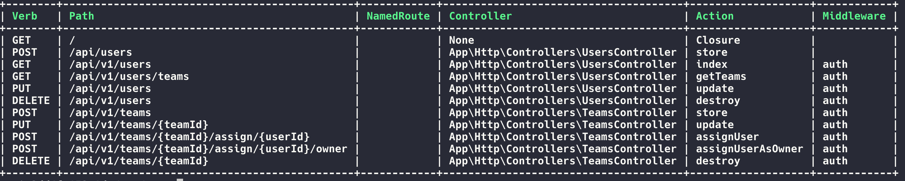
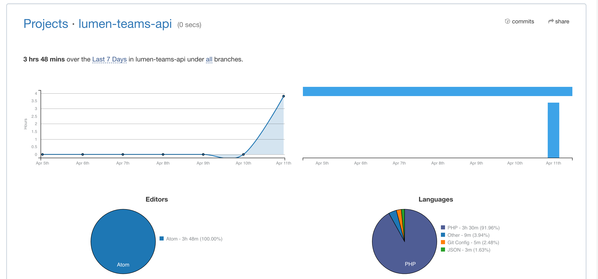
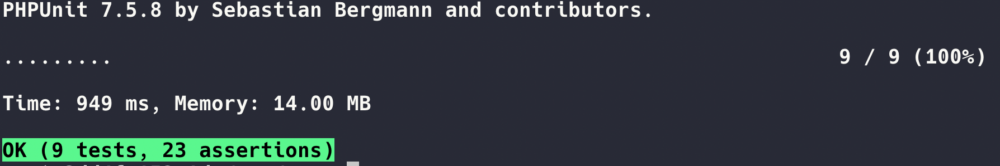

# Lumen Teams API

[TOC]


## Summary

##### Introduction

This API was intended to mange teams and the users of the teams. 

A user can be assigned as an owner role of team and ideally be the super user of it, where could manage the team members, editing the team informations and delete a team and user.

A user of the team could only be assigned to a team and have a a role as a viwer of the team, be able to see who are the other mebers of the team and may have some access to particular info. This user role could only edit his own info and be able to be a member to different teams.  

A user could also list the teams and see to what tems is assigned to.

##### Lumen

This REST API was developed using the micro-framework **Lumen**.
Lumen is a light version of Laravel and can be upgraded easaly to Laravel, as it is using same language, syntax and components. 
For this project case, using Lumen, was a natural choice as we ere building an API. We essetial need only the routing, logging, caching, queues, validation, error handling and some more. Being this only backend we avoid the resources of Laravel as full-framework gives to us as views, assets, cookies and sessions. 
For an API we want to be light and fast, so we use the speciliazed Lumen for it.

The standard concepts of Lumen were followed to create the project. Were created Models and Migrations to create the related tables. Then were created the Controllers and Repositories to define the end-points and the functionality of it. To assure quality Unit Tests were added. 

##### Repository Pattern

We followed the **Repository Pattern**, some sort of collections. It's contain of entities and data sources. We can filtered and return what entities back based on the needs of the application.

The main point is that the application does not have to know data is implemented. This makes it easier to switch to another data source or implement structural changes to the existing data source.

In our API we defined Repository Interfaces. Which define how the application communicate with entities. Each repository has its own class which implements the repository interface. The controller class will just call method that defined in interface and will not know how and where the data from.  

As an example of the Repository Pattern, firstly, we design a RESTful POST route and UserController. 
The next thing is, create a repository interface and we did adding a new folder **Repositories** and keeping a folder API structure. Then we created UserRepository that is responsible for holding business rules and business logic.
To be able to use the new classe we registered the service provider.

The benefits to separate of data access from business logic are:

- Centralization of the data access logic makes code easier to maintain
- Business and data access logic can be tested separately
- Reduces duplication of code
- A lower chance for making programming errors

##### The API

The main points of these API are as follow:

- CRUD functionality for a “user” and a “team” entity 
- A user can be assigned to multiple teams 
- Set a user as team owner 
- Assign different roles to users 
- Validate input 
- List what teams the users belong to. 

The access to the api end-points is given by an api-token (excluded to create a new user) to allow only authorised user to access or modify the data.

##### CRUD

The API follows the CRUD functionalities and the end-points permit the following actions:

Route list:



End-points:

```php
// Create a User -> to a new User is assigned an api_token to have access to the rest of the //                  end-points as an authorized user
POST: {LOCAL_HOST}/api/users , DATA: [name{required}, email:{required|unique|email}]

// List all Users
GET: {LOCAL_HOST}/api/v1/users , PARAM: [api_token{required}]

// List all Teams
GET: {LOCAL_HOST}/api/v1/users/teams , PARAM: [api_token{required}]

// Edit a User
PUT: {LOCAL_HOST}/api/v1/users , DATA: [api_token{required}, name{required}]

// Delete a User
DELETE: {LOCAL_HOST}/api/v1/users , DATA: [api_token{required}]

// Create a Team
POST: {LOCAL_HOST}/api/v1/teams , DATA: [api_token{required}, title{required}]

// Edit a Team
PUT: {LOCAL_HOST}/api/v1/teams/{teamID} , DATA: [api_token{required}, title{required}]

// Assign Team to a User
POST: {LOCAL_HOST}/api/v1/teams/{teamID}/assign/{userId} , DATA: [api_token{required}]

// Assign Team to a User Owner
POST: {LOCAL_HOST}/api/v1/teams/{teamID}/assign/{userId}/owner , DATA: [api_token{required}]

// Delete a Team
DELETE: {LOCAL_HOST}/api/v1/teams/{teamID} , DATA: [api_token{required}]
  
```


##### With more time what could be done

Essentially with more time the API could be done more efficient, maintainable, DRY and could have more functionalities.

Some of the sissues which could be cared better are:

- Would have create more clear response structure for errors and succes
- A better User access managemnt as would have create a resource collection files so in the response only those fields that are available to the user to see  would be available only. Like we now have all users can see all suers info with the given api_token. Ideally that user should be able to see only some specific info and not as now like the other Users api_token as sensible data.  
- Would fix the issue when User is assigned to the team as `member` and when you assign it as a `owner` the previous role should be removed. Would be better to keep cleaner the stricture and flow of the API.
- Would fix some duplicates and keep the structure more DRY.
- Posisble addons make the Owner of a team being a super user, with the power to manage the team/teams and be able to manage all the info and the components of a team.
- Add more fields for the User and the Team as a Team description or User personal info.
- Extra security could be added and a login/register system with a password with some better validation handler to avoid any security breach.
- Better Unit Testing is always a good practice.

In general terms this API could be done better, making some of the functionality better and eliminate the duplicates as it is in the following of a DRY code practice. Also would be better to add some more code comments for a better code documentation and understanding. For a better docuemntation could be implemnted **Swagger** a nice way to show how the API is structured in a easy way. 

##### The focus

The focus was put on a initial planning, what kind of an API we are gonna to build, what we need or not. Decision interms of packages usage or other tools could may be useful in this project case. What database structure we need. 
Then after the initial planning and research the effort was put in the development of a quality code, testable, mintainable and readable. 
Focus was put on also on the relationships between the entities and to make it right and the roles the user should be assigned.

##### What easy What hard

The hard of a project case like this is to decide and plan what could be done in limited time. What we need as our core and what to prirititze and what may be ignored in this stage. Planning helps to stand a situation like that. 

Having an analytic mind helps to plan efficienlty a project. 
The API itself was not presenting a big complexity but an eye to a tricky part was about the roles as a research was need. Lumen as a difference from Laravel has not build-in a role managemnt package and was necessary to use the package **`spatie/laravel-permission`** to mange the user roles/permisisons. 

In general the API was a nice task and the major complexity was the limited times which comported to make some important dsecsion during the planning and during the development itself.

## Technical Overview

The project was completed approximately in **3h48m** as proved from the time tracker tool attached to the editor to track **live** the coding. 

The prove:


- The API was built witth `Lumen 5.8.4` and as developlment enviroemtn was used `Laradock` a Docker solution for Laravel/lumen and PHP with Nginx, Mysql and else.  
- End-points tested via `Postman`
- `PhpUnit` as Unit testing tool 

##### Packages added:

- `spatie/laravel-permission` useful to manage roles and permisison 
- `Soft Deletes` for the Eloquent tables to keep all records but mark them as `deleted_at` the same time (for maybe restore functionality) some sort of a back up plan in case of an issue. 

##### Unit tests results




